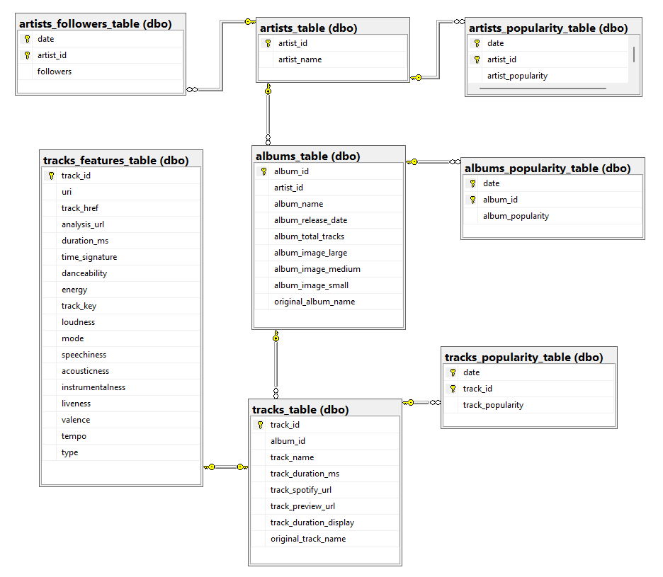

# Extract-Transform-Load: From Spotify to Azure

### Summary:
For this project, we created a SQL Server database on the cloud using Microsoft Azure. The objective was to extract data for legendary rock 🎸 artists from the Spotify API, transform/clean the data, and then load it into our cloud database, resulting in a database that is automatically updated daily.

### Extract-Transform-Load process:

#### Extract-Transform:
Data extraction and transformation/cleaning are handled in the `extract_transform_data.py` Python script. In this script we have implemented functions that extract artist data from Spotify API given a list of artist names. Then they get every album and track for each artist. Also, using suitable regular expressions they keep only original albums and tracks by removing live, demo, deluxe versions. We end up with a single function `get_static_tables` at the end of the script  that extracts and transforms/cleans every static data table.

#### Load:
We created the database tables and also load the static (time independent) data by running the Python script `create_DB_load_static_data.py` once. At this stage, we connected Python to our database to execute SQL queries for creating our tables. The tables and their connections are illustrated in the following database diagram.

 Moving forward, we called `get_static_tables` function we mentioned earlier to get the static tables and finally loaded them into our database using pandas.

For dynamic data, such as artist, album, and track popularity, as well as artist followers, we have scheduled daily database updates using GitHub Actions to execute the `main.py` Python script. This script handles the ETL process for the dynamic data tables daily and writes to the `status.log` file to indicate whether the code execution was successful. The `status.log` is now stored as a GitHub Artifact. This ETL process is illustrated in the image that follows.

